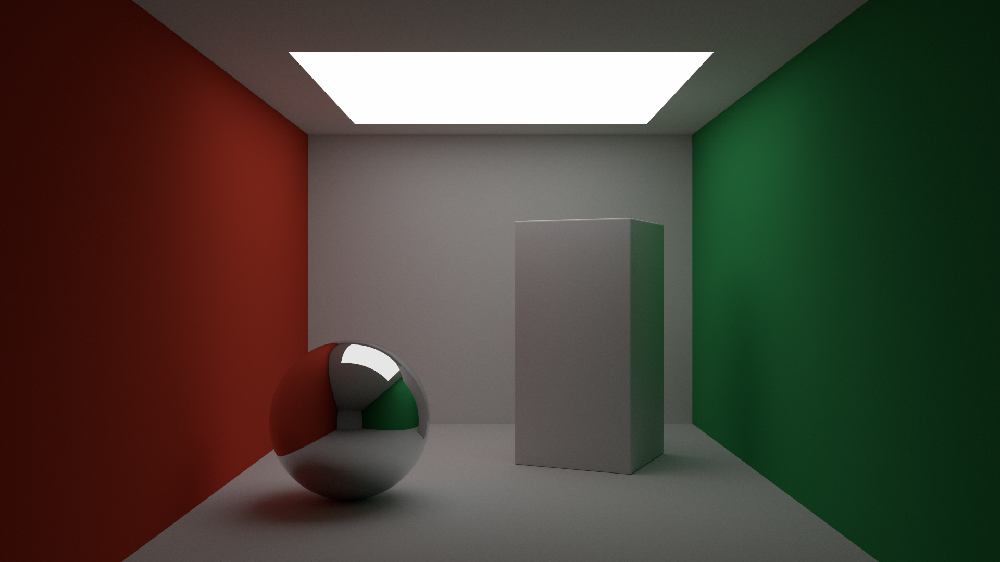
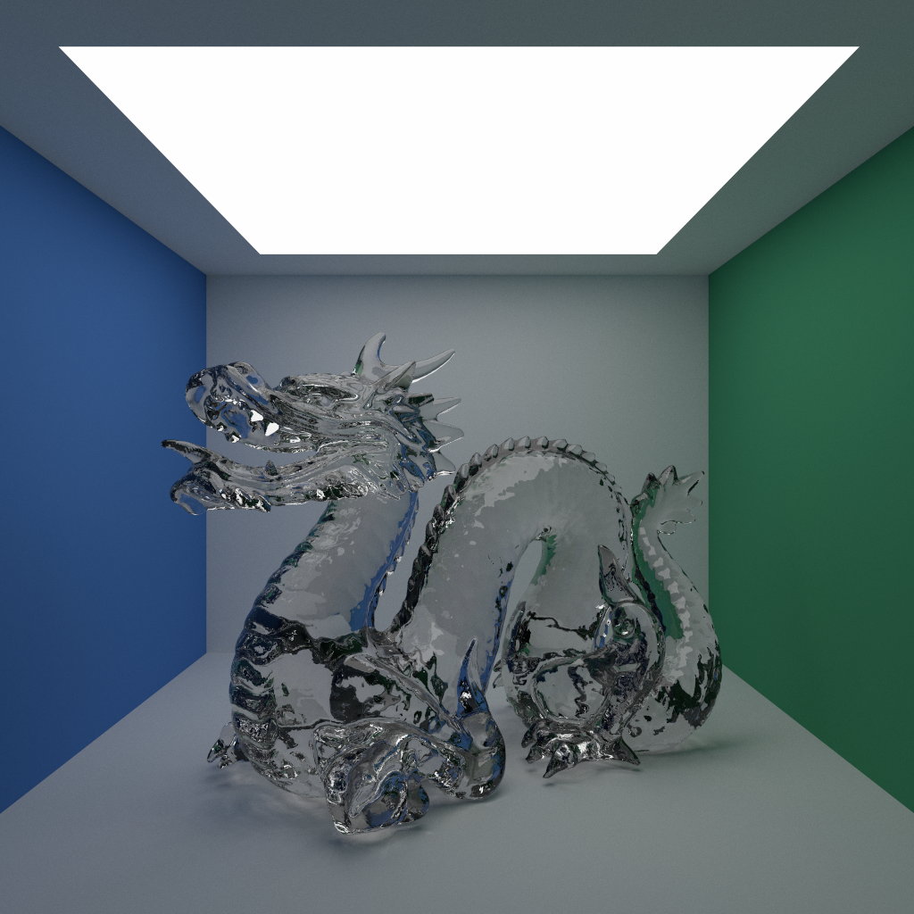
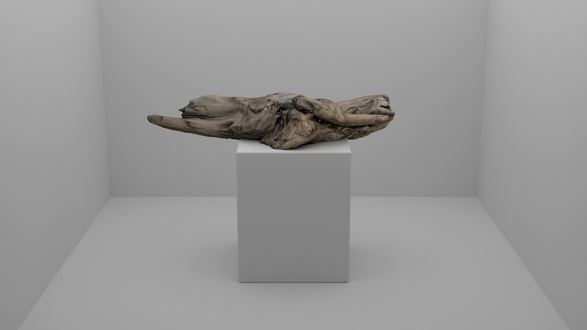
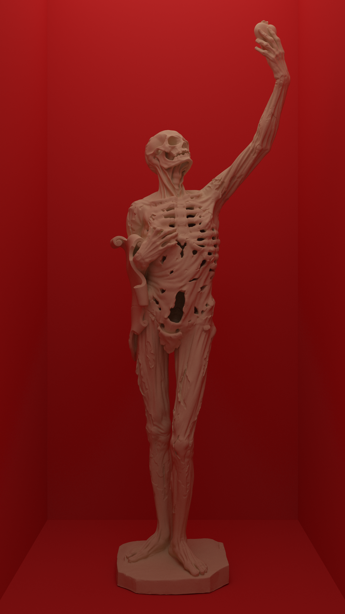

# Ray Tracer

A Monte Carlo Ray Tracer (Path Tracer) written in Rust.

This project was developed as an educational exploration of ray tracing and global illumination. The implementation is inspired by the book [Ray Tracing in One Weekend](https://raytracing.github.io/books/RayTracingInOneWeekend.html).

## Features

- Path Tracing
  - Monte Carlo global illumination
  - Multiple bounces (recursive rays)
- Materials
  - Diffuse (Lambertian)
  - Perfect reflections
  - Glass / dielectric refraction
  - Emissive materials (light sources)
- Acceleration Structure
  - Bounding Volume Hierarchy (BVH)
  - Fast traversal for ray intersection tests
  - BVH construction and intersection approach adopted from [https://jacco.ompf2.com/2022/04/13/how-to-build-a-bvh-part-1-basics/](https://jacco.ompf2.com/2022/04/13/how-to-build-a-bvh-part-1-basics/)
- Scene Import
  - glTF scene loading
  - Triangle mesh rendering only
- Parallel Rendering
  - Multithreaded rendering using [rayon](https://docs.rs/rayon/latest/rayon/)
  - Image rows rendered in parallel across CPU cores

## Running the Ray Tracer

Ensure you have Rust installed.

Build the project:

```
cargo build --release
```

Run the renderer:

```
cargo run --release
```

Rendering parameters such as resolution, sample count, can be configured in the __src/lib.rs__ file.

## Gallery



*Figure 1: Raytraced rendering of the Cornell Box.*

---



*Figure 2: Raytraced rendering of the Stanford Dragon. Source: [Stanford 3D Scanning Repository](http://graphics.stanford.edu/data/3Dscanrep/).*

---



*Figure 3: Raytraced rendering of a self-scanned driftwood.*

---



*Figure 4: Raytraced rendering of the cadaver monument of Rene de Chalon. Source: [Three D Scans, Le Transi de Rene de Chalon](https://threedscans.com/musee-des-monuments-francais/le-transi-de-rene-de-chalon/).*

## License

This project is licensed under the MIT License. See the LICENSE file for details.
