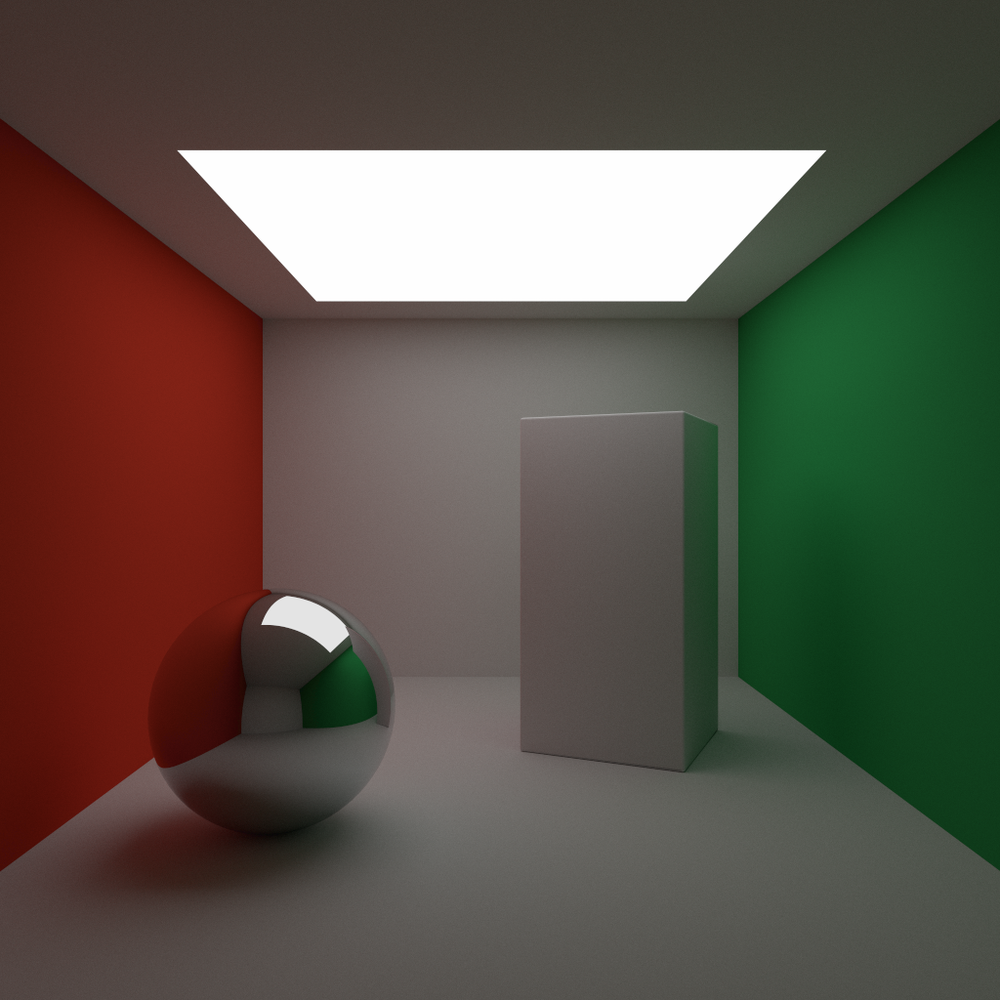

# Raytracer

A raytracer written in Rust.

# Gallery

*Figure 1: Raytraced rendering of the Cornell Box.*

---

*Figure 2: Raytraced rendering of the Stanford Dragon. Source: [Stanford 3D Scanning Repository](http://graphics.stanford.edu/data/3Dscanrep/).*

---

*Figure 3: Raytraced rendering of a self-scanned driftwood.*

---

*Figure 4: Raytraced rendering of the cadaver monument of Rene de Chalon. Source: [Three D Scans, Le Transi de Rene de Chalon](https://threedscans.com/musee-des-monuments-francais/le-transi-de-rene-de-chalon/).*
